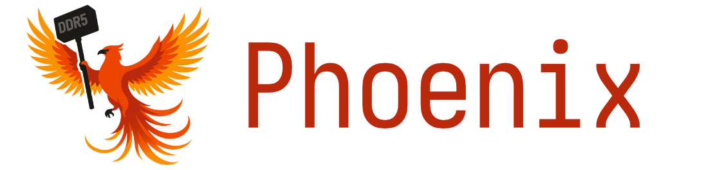

<p align="center">
  <a href="#"></a>
  <a href="https://opensource.org/licenses/gpl-3-0"></a>
  <a href="#"></a>
  
  <a href="https://www.cve.org/cverecord?id=CVE-2025-6202"></a>
</p>

These are the artifacts for the research paper "**Phoenix: Rowhammer Attacks on DDR5 with Self-Correcting Synchronization**" that is to appear at IEEE Security & Privacy 2026. This repository provides all the resources necessary to explore, reproduce, and build upon our work.

We demonstrate with Phoenix, Rowhammer bit flips on DDR5 DIMMs on all 15 tested SK Hynix DIMMs from a commodity PC system. To achieve this, we reverse engineered the TRR mechanism of these DIMMs and found that there are blind spots in their mitigations, allowing us to build new Rowhammer patterns exploiting these blind spots. However, due to the large TRR-internal state, our new patterns are between 128 and 2608 tREFI intervals long, making it difficult to synchronize with refresh commands often enough until triggering bit flips. Therefore, we developed a new self-correcting refresh synchronization method that automatically adapts the hammering pattern's execution whenever it detects that a refresh command was missed. Equipped with this primitive, we show that we can build the first DDR5 Rowhammer privilege escalation exploit on a system with default settings, requiring as little as 109 seconds.

| | |
| --------------| --------------------------------------------------------------------
| Authors       | Diego Meyer<sup>C</sup>, Patrick Jattke<sup>C</sup>, Michele Marazzi<sup>C</sup>, Salman Qazi<sup>G</sup>, Daniel Moghimi<sup>G</sup>, and Kaveh Razavi<sup>C</sup>
| Organizations  | <sup>C</sup>ETH Zurich, [COMSEC Group](https://comsec.ethz.ch/); <sup>G</sup>[Google Inc.](https://security.googleblog.com/2025/09/supporting-rowhammer-research-to.html)
| Publisher     | [2026 IEEE Symposium on Security and Privacy (SP)](https://www.ieee-security.org/TC/SP2026/)
| Webpage       | https://comsec.ethz.ch/phoenix
| Paper         | https://comsec-files.ethz.ch/papers/phoenix_sp26.pdf
| | |

## Repository Overview

We facilitate studying and extending our work by providing the following artifacts:

- **[fpga-experiments](fpga-experiments/README.md):** The FPGA-based experiments to reverse engineer the TRR implementation of the two SK Hynix DIMMs that we described in §4 and Appendix A of our paper.

- **[poc](poc/README.md):** The proof-of-concept code demonstrating bit flips with the Phoenix attack on commodity systems, as described in §6 of our paper.

- **[e2e-exploit](e2e-exploit/README.md):** The end-to-end privilege escalation exploit targeting page-table entries (PTEs), as described in §7.3 of our paper. The exploit is based on [Rubicon](https://github.com/comsec-group/rubicon).

- **[plots](plots/README.md):** The scripts to generate the plots presented in our paper. 

## Data

We provide the raw data obtained by our experiments in directory of the respective plotting script. However, the data can also be reproduced by running the experiment code (see [fpga-experiments](fpga-experiments/README.md)) on the [Antmicro DDR5 RDIMM Tester platform](https://github.com/antmicro/rdimm-ddr5-tester) using the same RDIMMs.

## Citing our paper

Please use the following BibTeX entry to cite our work:

```
@inproceedings{meyer2025phoenix,
  title     = {{Phoenix: Rowhammer Attacks on DDR5 with Self-Correcting Synchronization}},
  author    = {Meyer, Diego and Jattke, Patrick and Marazzi, Michele and Qazi, Salman and Moghimi, Daniel and Razavi, Kaveh},
  booktitle = {Proceedings of the 2026 IEEE Symposium on Security and Privacy (SP)},
  year      = {2026},
  month     = may,
  publisher = {IEEE},
  address   = {San Francisco, CA, USA},
}
```
